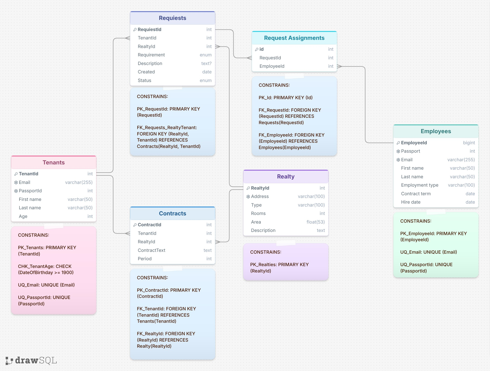

8# УПРАВЛЕНИЕ АРЕНДНОЙ НЕДВИЖИМОСТЬЮ

Для данной работы выбран сценарий: **Управление арендной недвижимостью.** Эта система позволяет отслеживать арендную недвижимость, арендаторов, договоры аренды и запросы на обслуживание.

## Цели и задачи системы

Цель системы — автоматизировать управление арендной недвижимостью: учёт объектов, арендаторов, договоров и заявок на обслуживание в единой базе данных. Это исключает дублирование данных, ошибки при оформлении договоров и обеспечивает прозрачность всех операций.

Система ведёт справочники арендаторов и объектов недвижимости с проверкой уникальности контактов и паспортных данных. Управление договорами (таблица *Contracts*) фиксирует связь арендатора с объектом, хранит текст договора и контролирует срок аренды, предотвращая конфликтные бронирования.

Заявки на обслуживание (таблица *Requests*) привязываются к действующим договорам. Через промежуточную таблицу *Request Assignments* реализуется назначение исполнителей: одна заявка может быть передана нескольким сотрудникам, а один сотрудник — выполнять множество заявок. Это обеспечивает прозрачную маршрутизацию задач и контроль их выполнения.

В результате система сокращает время поиска информации, автоматизирует контроль сроков договоров, структурирует поток заявок и чётко распределяет ответственность между персоналом.

## Сущности

1. Арендаторы
2. Недвижимость
3. Запросы на обслуживание
4. Договоры
5. Сотрудники (те, кто будет обслуживать)

## Проектирование таблиц

### 1. Table name: Tenants

- **Description:** Информация об арендаторе
- **Attributes:**
  - **TenantId:** INTEGER, PK
  - **Email:** VARCHAR(255), NOT NULL, UNIQUE
  - **PassportId:** INTEGER, NOT NULL, UNIQUE
  - **First Name:** VARCHAR(100), NOT NULL
  - **Last Name:** VARCHAR(100), NOT NULL
  - **DateOfBirthday:** DATE, NOT NULL
- **Constraints:**
  - **PK_Tenants:** PRIMARY KEY (TenantId)
  - **CHK_TenantAge:** CHECK (DateOfBirthday >= 1900)
  - **UQ_Email:** UNIQUE (Email)
  - **UQ_PassportId:** UNIQUE (PassportId)

### 2. Table name: Realty

- **Description:** Описание недвижимости
- **Attributes:**
  - **RealtyId:** INTEGER, PK
  - **Address:** VARCHAR(100), NOT NULL, UNIQUE
  - **Type:** VARCHAR(100), NOT NULL
  - **Rooms:** INTEGER, NOT NULL, CHECK (Rooms > 0)
  - **Area:** FLOAT, NOT NULL, CHECK (Area > 0)
  - **Description:** TEXT, NOT NULL
- **Constraints:**
  - **PK_Realties:** PRIMARY KEY (RealtyId)

### 3. Table name: Requests

- **Description:** Запрос на обслуживание недвижимости
- **Attributes:**
  - **RequestId:** INTEGER, PK
  - **TenantId:** INTEGER, FK
  - **RealtyId:** INTEGER, FK
  - **Requirement:** ENUM('Repair', 'Cleaning', 'Check', 'Other'), DEFAULT 'Other', NOT NULL
  - **Description:** TEXT
  - **Created:** DATE, NOT NULL
  - **Status:** ENUM('Not started', 'In progress', 'Completed'), NOT NULL
- **Constraints:**
  - **PK_RequestId:** PRIMARY KEY (RequestId)
  - **FK_Requests_RealtyTenant:** FOREIGN KEY (RealtyId, TenantId) REFERENCES Contracts(RealtyId, TenantId)

### 4. Table name: Contracts

- **Description:** Договоры аренды недвижимости
- **Attributes:**
  - **ContractId:** INTEGER, PK
  - **TenantId:** INTEGER, FK
  - **RealtyId:** INTEGER, FK
  - **ContractText:** TEXT, NOT NULL
  - **ContractStartDay:** DATE, NOT NULL
  - **ContractEndDay:** DATE, NOT NULL
- **Constraints:**
  - **PK_ContractId:** PRIMARY KEY (ContractId)
  - **FK_TenantId:** FOREIGN KEY (TenantId) REFERENCES Tenants(TenantId)
  - **FK_RealtyId:** FOREIGN KEY (RealtyId) REFERENCES Realty(RealtyId)
  - **UQ_ContractPair:** UNIQUE (TenantId, RealtyId)

### 5. Table name: Employees

- **Description:** Сотрудники, обслуживающие номера
- **Attributes:**
  - **EmployeeId:** INTEGER, PK
  - **PassportId:** INTEGER, NOT NULL, UNIQUE
  - **Email:** VARCHAR(255), UNIQUE
  - **First name:** VARCHAR(50), NOT NULL
  - **Last name:** VARCHAR(50), NOT NULL
  - **Employment type:** VARCHAR(100), NOT NULL
  - **Contract term:** DATE, NOT NULL
  - **Hire date:** DATE, NOT NULL
- **Constraints:**
  - **PK_EmployeeId:** PRIMARY KEY (EmployeeId)
  - **UQ_Email:** UNIQUE (Email)
  - **UQ_PassportId:** UNIQUE (PassportId)

### 6. Table name: Request Assignments

- **Description:** Таблица для реализации связи между запросами и выполняющими их сотрудниками
- **Attributes:**
  - **Id:** INTEGER, PK
  - **RequestId:** INTEGER, FK
  - **EmployeeId:** INTEGER, FK
- **Constraints:**
  - **PK_Id:** PRIMARY KEY (Id)
  - **FK_RequestId:** FOREIGN KEY (RequestId) REFERENCES Requests(RequestId)
  - **FK_EmployeeId:** FOREIGN KEY (EmployeeId) REFERENCES Employees(EmployeeId)

## Описание взаимосвязей между таблицами

1. ***Tenants* и *Contracts* (Один-ко-Многим):** один арендатор может заключить множество договоров аренды, но каждый договор относится к одному конкретному арендатору.  
   *Contracts.TenantId* является внешним ключом (FK), ссылающимся на *Tenants.TenantId*.

2. ***Realty* и *Contracts* (Один-ко-Многим):** один объект недвижимости может фигурировать во множестве договоров (например, в разные периоды или с разными арендаторами), но каждый договор заключён в отношении одного конкретного объекта.  
   *Contracts.RealtyId* является внешним ключом (FK), ссылающимся на *Realty.RealtyId*.

3. ***Tenants* и *Requests* (Один-ко-Многим):** один арендатор может подать множество заявок, но каждая заявка создана одним конкретным арендатором.  
   *Requests.TenantId* является внешним ключом (FK), ссылающимся на *Tenants.TenantId*.

4. ***Realty* и *Requests* (Один-ко-Многим):** один объект недвижимости может быть указан во множестве заявок, но каждая заявка относится к одному конкретному объекту.  
   *Requests.RealtyId* является внешним ключом (FK), ссылающимся на *Realty.RealtyId*.

5. ***Requests* и *Request Assignments* (Один-ко-Многим):** одна заявка может быть назначена нескольким сотрудникам (или иметь несколько записей о назначении), но каждая запись в таблице назначений относится к одной конкретной заявке.  
   *RequestAssignments.RequestId* является внешним ключом (FK), ссылающимся на *Requests.RequestId*.

6. ***Employees* и *Request Assignments* (Один-ко-Многим):** один сотрудник может быть назначен на выполнение множества заявок, но каждая запись о назначении закреплена за одним конкретным сотрудником.  
   *RequestAssignments.EmployeeId* является внешним ключом (FK), ссылающимся на *Employees.EmployeeId*.

## SQL-код (PostgreSQL)

```sql
CREATE TYPE requirement_enum AS ENUM ('Repair', 'Cleaning', 'Check', 'Other');
CREATE TYPE request_status_enum AS ENUM ('Not started', 'In progress', 'Completed');

CREATE TABLE Tenants (
    TenantId    SERIAL PRIMARY KEY,
    Email       VARCHAR(255) NOT NULL UNIQUE,
    PassportId  INTEGER NOT NULL UNIQUE,
  "First Name"   VARCHAR(100) NOT NULL,
  "Last Name"    VARCHAR(100) NOT NULL,
  DateOfBirthday  DATE NOT NULL CHECK (DateOfBirthday >= 1900)
);

CREATE TABLE Realty (
    RealtyId    SERIAL PRIMARY KEY,
    Address     VARCHAR(100) NOT NULL UNIQUE,
    Type        VARCHAR(100) NOT NULL,
    Rooms       INTEGER NOT NULL CHECK (Rooms > 0),
    Area        FLOAT NOT NULL CHECK (Area > 0),
    Description TEXT NOT NULL
);

CREATE TABLE Contracts (
    ContractId        SERIAL PRIMARY KEY,
    TenantId          INTEGER NOT NULL,
    RealtyId          INTEGER NOT NULL,
    ContractText      TEXT NOT NULL,
    ContractStartDay  DATE NOT NULL,
    ContractEndDay    DATE NOT NULL,
    UNIQUE (TenantId, RealtyId),
    CONSTRAINT FK_TenantId FOREIGN KEY (TenantId) REFERENCES Tenants(TenantId),
    CONSTRAINT FK_RealtyId FOREIGN KEY (RealtyId) REFERENCES Realty(RealtyId)
);

CREATE TABLE Requests (
    RequestId    SERIAL PRIMARY KEY,
    TenantId     INTEGER NOT NULL,
    RealtyId     INTEGER NOT NULL,
    Requirement  requirement_enum NOT NULL DEFAULT 'Other',
    Description  TEXT,
    Created      DATE NOT NULL,
    Status       request_status_enum NOT NULL,
    CONSTRAINT FK_Requests_ContractPair
      FOREIGN KEY (TenantId, RealtyId) REFERENCES Contracts(TenantId, RealtyId)
);

CREATE TABLE Employees (
    EmployeeId      SERIAL PRIMARY KEY,
    PassportId      INTEGER NOT NULL UNIQUE,
    Email           VARCHAR(255) UNIQUE,
  "First name"    VARCHAR(50) NOT NULL,
  "Last name"     VARCHAR(50) NOT NULL,
  "Employment type" VARCHAR(100) NOT NULL,
  "Contract term" DATE NOT NULL,
  "Hire date"     DATE NOT NULL
);

CREATE TABLE "Request Assignments" (
    Id          SERIAL PRIMARY KEY,
    RequestId   INTEGER NOT NULL,
    EmployeeId  INTEGER NOT NULL,
    CONSTRAINT FK_RequestId FOREIGN KEY (RequestId) REFERENCES Requests(RequestId),
    CONSTRAINT FK_EmployeeId FOREIGN KEY (EmployeeId) REFERENCES Employees(EmployeeId)
);
```

## ER-диаграмма


