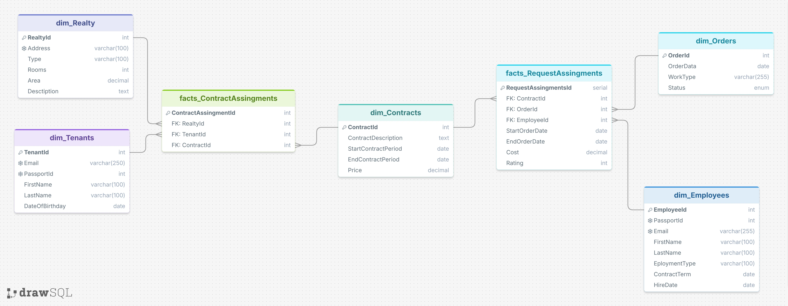

# Проектирование хранилища данных (Data Warehouse)
## Область: Управление арендной недвижимостью

---

## 1. Конкретный бизнес-процесс

**Название:** Обработка заявок на техническое обслуживание и ремонт арендной недвижимости

**Описание:**
В рамках управления арендным бизнесом арендаторы (tenants) по договорам аренды (contracts) размещают заявки на проведение ремонтных, сантехнических, электромонтажных и иных работ в арендуемых помещениях. Заявки регистрируются в системе, после чего назначаются ответственные сотрудники (employees), которые выполняют работы в определённый период. По результатам выполнения фиксируются фактические расходы (cost) и оценка качества (rating).

**Участники процесса:**
- **Арендатор (Tenant)** — инициатор заявки, арендатор недвижимости
- **Объект недвижимости (Realty)** — помещение, по которому выполняются работы
- **Договор аренды (Contract)** — юридическая основа взаимоотношений
- **Заказ/заявка (Order)** — описание типа работ и текущий статус
- **Сотрудник (Employee)** — исполнитель, назначенный на выполнение работ

**Цели аналитики:**
- Анализ расходов на обслуживание недвижимости по периодам
- Оценка загрузки и эффективности сотрудников
- Анализ прибыльности контрактов (доход от аренды vs расходы на обслуживание)
- Выявление «проблемной» недвижимости с повышенными расходами на ремонт
- Анализ сезонности и динамики заявок
- Распределение заказов по статусам и их динамика

---

## 2. Уровень детализации (Grain)

**Grain определение:**
> Одна строка в таблице фактов = **одно назначение сотрудника на выполнение конкретного заказа (order) в рамках конкретного контракта аренды (contract) в конкретный период времени**.

**Почему именно этот уровень:**
- Каждая заявка (order) может быть выполнена одним сотрудником в рамках одного назначения (assignment)
- На этом уровне фиксируются конкретные метрики: `Cost` (фактическая стоимость работ) и `Rating` (оценка выполнения)
- Дата начала (`StartOrderDate`) и дата окончания (`EndOrderDate`) относятся именно к выполнению конкретного заказа
- Это наиболее детальный (atomic) уровень, с которого можно агрегировать данные вверх (к месяцам, кварталам, годам, по сотрудникам, по объектам недвижимости и т.д.)

---

## 3. Таблицы измерений (Dimension Tables)

### 3.1 dim_Tenants (Арендаторы)

| Атрибут | Тип данных | Описание |
|---------|-----------|----------|
| `TenantId` | SERIAL (INT) | Суррогатный ключ (PK) |
| `PassportId` | BIGINT | Натуральный ключ (паспорт), уникален |
| `Email` | VARCHAR(250) | Контактный email, уникален |
| `FirstName` | VARCHAR(100) | Имя |
| `LastName` | VARCHAR(100) | Фамилия |
| `DateOfBirthday` | DATE | Дата рождения (ограничение: > 1900-01-01) |

**Роль в бизнес-процессе:** Определяет, кто из арендаторов инициировал заявку через связь с контрактом.

**Рекомендуемый тип SCD:** **Type 2 (SCD2)** — ФИО и паспортные данные могут меняться (смена фамилии, замена паспорта). Требуются поля `ValidFrom`, `ValidTo`, `IsCurrent`.

---

### 3.2 dim_Realty (Недвижимость)

| Атрибут | Тип данных | Описание |
|---------|-----------|----------|
| `RealtyId` | SERIAL (INT) | Суррогатный ключ (PK) |
| `Address` | VARCHAR(100) | Адрес объекта, уникален |
| `Type` | VARCHAR(100) | Тип (Квартира, Офис, Дом, Таунхаус и т.д.) |
| `Rooms` | INT | Количество комнат (> 0) |
| `Realty_Area` | DECIMAL(8,2) | Площадь (м²) (> 0) |
| `Description` | TEXT | Описание |

**Роль в бизнес-процессе:** Определяет объект недвижимости, по которому выполнялись работы.

**Рекомендуемый тип SCD:** **Type 2 (SCD2)** — площадь, количество комнат или описание могут меняться при перепланировке.

---

### 3.3 dim_Contracts (Договоры аренды)

| Атрибут | Тип данных | Описание |
|---------|-----------|----------|
| `ContractId` | SERIAL (INT) | Суррогатный ключ (PK) |
| `ContractDescription` | TEXT | Описание договора |
| `StartContractPeriod` | DATE | Дата начала действия договора |
| `EndContractPeriod` | DATE | Дата окончания договора |
| `Price` | DECIMAL | Месячная арендная плата (≥ 0) |

**Ограничения:**
- `EndContractPeriod > StartContractPeriod`

**Роль в бизнес-процессе:** Определяет договорные условия, в рамках которых выполняется заявка. От `Price` зависит расчёт дохода (earned) при анализе рентабельности.

**Рекомендуемый тип SCD:** **Type 0 (Fixed)** — договор аренды является юридически неизменяемым документом. При изменении условий создаётся новый контракт с новым `ContractId`. Историчность обеспечивается через даты `StartContractPeriod` / `EndContractPeriod`.

---

### 3.4 dim_Orders (Заказы / Заявки)

| Атрибут | Тип данных | Описание |
|---------|-----------|----------|
| `OrderId` | SERIAL (INT) | Суррогатный ключ (PK) |
| `OrderDate` | DATE | Дата регистрации заявки |
| `WorkType` | VARCHAR(255) | Тип работ (Сантехника, Электрика, Покраска и т.д.) |
| `Status` | VARCHAR(255) | Статус заявки (Выполнено, Отказано, В процессе) |

**Роль в бизнес-процессе:** Определяет характер работ, которые необходимо выполнить.

**Рекомендуемый тип SCD:** **Type 0 (Fixed)** — заявка регистрируется один раз и не изменяется. Статус можно трактовать как дегенеративный атрибут факта или вести отдельную таблицу истории статусов.

---

### 3.5 dim_Employees (Сотрудники)

| Атрибут | Тип данных | Описание |
|---------|-----------|----------|
| `EmployeeId` | SERIAL (INT) | Суррогатный ключ (PK) |
| `PassportId` | BIGINT | Паспортные данные, уникальны |
| `Email` | VARCHAR(255) | Корпоративная почта, уникальна |
| `FirstName` | VARCHAR(100) | Имя |
| `LastName` | VARCHAR(100) | Фамилия |
| `EmploymentType` | VARCHAR(100) | Должность / специализация |
| `ContractTerm` | DATE | Дата окончания трудового договора |
| `HireDate` | DATE | Дата приёма на работу |

**Ограничения:**
- `ContractTerm > HireDate`

**Роль в бизнес-процессе:** Определяет исполнителя, назначенного на выполнение заявки.

**Рекомендуемый тип SCD:** **Type 2 (SCD2)** — сотрудник может менять должность (`EmploymentType`), продлевать или заканчивать трудовой договор (`ContractTerm`).

---

## 4. Таблица фактов (Fact Table)

### 4.1 facts_RequestAssignments (Назначения заявок)

**Тип таблицы фактов:** **Транзакционная (Transaction Fact Table)** — каждая строка описывает одну бизнес-транзакцию (выполнение заявки).

| Поле | Тип данных | Роль | Описание |
|------|-----------|------|----------|
| `RequestAssignmentsId` | SERIAL | Дегенеративный ключ | Уникальный ID строки (не используется для аналитики) |
| `FK_ContractId` | INT | Внешний ключ → dim_Contracts | Договор аренды |
| `FK_OrderId` | INT | Внешний ключ → dim_Orders | Заказ/заявка |
| `FK_EmployeeId` | INT | Внешний ключ → dim_Employees | Исполнитель |
| `FK_Tenant` | INT | Внешний ключ → dim_Tenants | Арендатор |
| `FK_Realty` | INT | Внешний ключ → dim_Realty | Объект недвижимости |
| `StartOrderDate` | DATE | Дегенеративный атрибут / частичный FK | Дата начала выполнения работ |
| `EndOrderDate` | DATE | Дегенеративный атрибут / частичный FK | Дата завершения работ |
| `Cost` | DECIMAL(8,2) | **Метрика (Fact)** | Фактические расходы на выполнение заявки (≥ 0) |
| `Rating` | INT | **Метрика (Fact)** | Оценка качества выполнения (1–5) |

**Ограничения целостности:**
- `Cost >= 0`
- `Rating BETWEEN 1 AND 5`
- `EndOrderDate > StartOrderDate` или `EndOrderDate IS NULL`

### 4.2 Метрики (Measures)

| Метрика | Агрегация | Бизнес-смысл |
|---------|-----------|--------------|
| `Cost` | SUM, AVG | Общие / средние расходы на обслуживание |
| `Rating` | AVG, COUNT | Средняя оценка качества, количество оценок |


### 4.3 Производные метрики (Derived Measures)

На основе фактов и измерений рассчитываются:

| Производная метрика | Формула | Назначение |
|---------------------|---------|------------|
| **Доход (Earned)** | `dim_Contracts.Price × количество месяцев действия контракта в периоде` | Анализ рентабельности |
| **Длительность выполнения** | `EndOrderDate − StartOrderDate` | KPI скорости обслуживания |
| **Расходы на единицу площади** | `Cost / dim_Realty.Realty_Area` | Сравнительный анализ объектов |
| **Рентабельность контракта** | `Earned − Cost` | Оценка прибыльности |

---

## 5. Физическая модель — Схема «Звезда» (Star Schema)


**Тип схемы:** Звезда (Star Schema) — таблица фактов окружена пятью таблицами измерений без промежуточных справочников.

**Ключевые особенности связей:**
- Все связи из фактов в измерения — **многие-к-одному** (N:1)
- `dim_Contracts` логически связан с `dim_Tenants` и `dim_Realty` через бизнес-отношения, но в фактах используется прямой FK на `ContractId`
- Факты не содержат описательных атрибутов — только ключи и метрики

**Преимущества выбранной схемы:**
- Простота запросов (минимум JOIN-ов)
- Высокая производительность аналитических запросов
- Лёгкость понимания модели для бизнес-пользователей

---

## 6. Аналитические запросы

### 6.1 Загрузка и эффективность сотрудников

**Бизнес-вопрос:** Как распределена нагрузка между сотрудниками? Кто из них наиболее эффективен?

```sql
-- Для проверки загрузки работников по суммарному времени работы
SELECT 
    fr.fk_employeeid,
    CONCAT(de.firstname, ' ', de.lastname) AS full_name,
    SUM(fr.endorderdate - fr.startorderdate) AS total_working_time,
    COUNT(*) AS total_orders,
    AVG(fr.rating) AS average_rating
FROM 
    facts_requestassignments fr
INNER JOIN 
    dim_employees de
    ON fr.fk_employeeid = de.employeeid
WHERE 
    fr.startorderdate >= CURRENT_DATE - INTERVAL '1 year'
GROUP BY 
    fr.fk_employeeid,
    de.firstname,
    de.lastname
ORDER BY 
    total_working_time DESC;
```

**Интерпретация:** Показывает, сколько дней суммарно работал каждый сотрудник, сколько заявок выполнил и какую среднюю оценку получил.

---

### 6.2 Анализ прибыльности: доходы vs расходы по месяцам

**Бизнес-вопрос:** Какова финансовая эффективность бизнеса по месяцам? Покрывают ли арендные доходы расходы на обслуживание?

```sql
-- Генерация всех месяцев текущего года
WITH months AS ( 
    SELECT
        TO_CHAR(d, 'YYYY-MM') AS analysis_month,
        DATE_TRUNC('month', d) AS month_start,
        DATE_TRUNC('month', d) + INTERVAL '1 month' AS month_end
    FROM
        generate_series(
            DATE_TRUNC('year', NOW()),
            DATE_TRUNC('month', NOW()),
            INTERVAL '1 month'
        ) AS d
),
-- Расчёт расходов на обслуживание по месяцам
monthly_expenses AS ( 
    SELECT 
        TO_CHAR(fr.startorderdate, 'YYYY-MM') AS analysis_month,
        SUM(fr.cost) AS expenses
    FROM 
        facts_requestassignments fr
    WHERE 
        fr.startorderdate >= DATE_TRUNC('year', NOW())
        AND fr.endorderdate IS NOT NULL
    GROUP BY 
        TO_CHAR(fr.startorderdate, 'YYYY-MM')
),
-- Расчёт арендных доходов для каждого месяца
-- (даже если договор действует хотя бы один день в месяце)
monthly_earned AS ( 
    SELECT 
        m.analysis_month,
        SUM(dc.price) AS earned
    FROM
        months m
    INNER JOIN 
        dim_contracts dc 
        ON dc.startcontractperiod < m.month_end
        AND dc.endcontractperiod >= m.month_start
        AND dc.endcontractperiod >= DATE_TRUNC('year', NOW())
    GROUP BY 
        m.analysis_month
)
SELECT
    m.analysis_month,
    COALESCE(me.expenses, 0) AS expenses,
    COALESCE(mer.earned, 0) AS earned,
    (COALESCE(mer.earned, 0) - COALESCE(me.expenses, 0)) AS revenue
FROM 
    months m
LEFT JOIN 
    monthly_expenses me
    ON m.analysis_month = me.analysis_month
LEFT JOIN 
    monthly_earned mer
    ON m.analysis_month = mer.analysis_month;
```

**Интерпретация:** Для каждого месяца текущего года показывает: расходы на выполненные заявки, суммарные арендные доходы по всем активным договорам и чистую прибыль (revenue).

---

### 6.3 Распределение заказов по статусам

**Бизнес-вопрос:** Какова доля выполненных, отклонённых и находящихся в работе заявок?

```sql
-- Расчёт процентного соотношения заказов по статусам
SELECT
    COUNT(*) AS order_count,
    status,
    ROUND(COUNT(*) * 100.0 / SUM(COUNT(*)) OVER (), 2) AS percent
FROM 
    dim_orders
WHERE 
    orderdate > (CURRENT_DATE - INTERVAL '1 year')
GROUP BY
    status;
```

**Интерпретация:** Показывает абсолютное количество и процентное соотношение заявок по статусам за последний год. Помогает оценить качество обработки заявок.

---

### 6.4 Анализ расходов по объектам недвижимости

**Бизнес-вопрос:** Какие объекты недвижимости требуют наибольших расходов на обслуживание? Какова стоимость ремонта на квадратный метр?

```sql
SELECT 
    dr.realtyid,
    dr.address,
    dr.type,
    dr.realty_area,
    COUNT(fr.requestassignmentsid) AS total_orders,
    SUM(fr.cost) AS total_maintenance_cost,
    ROUND(SUM(fr.cost) / dr.realty_area, 2) AS cost_per_sqm,
    AVG(fr.rating) AS avg_rating
FROM 
    dim_realty dr
LEFT JOIN 
    facts_requestassignments fr
    ON dr.realtyid = fr.fk_realty
    AND fr.endorderdate IS NOT NULL
WHERE 
    fr.startorderdate >= CURRENT_DATE - INTERVAL '1 year'
    OR fr.requestassignmentsid IS NULL
GROUP BY 
    dr.realtyid,
    dr.address,
    dr.type,
    dr.realty_area
ORDER BY 
    total_maintenance_cost DESC NULLS LAST;
```

**Интерпретация:** Выявляет «проблемные» объекты с повышенными расходами на ремонт. Метрика `cost_per_sqm` позволяет сравнивать объекты разного размера.

---

### 6.5 Анализ типов работ и сезонность

**Бизнес-вопрос:** Какие виды работ наиболее востребованы? Есть ли сезонные колебания в заявках?

```sql
SELECT 
    do.worktype,
    TO_CHAR(do.orderdate, 'YYYY-MM') AS month,
    COUNT(*) AS order_count,
    SUM(fr.cost) AS total_cost,
    AVG(fr.rating) AS avg_rating
FROM 
    dim_orders do
LEFT JOIN 
    facts_requestassignments fr
    ON do.orderid = fr.fk_orderid
WHERE 
    do.orderdate >= CURRENT_DATE - INTERVAL '1 year'
GROUP BY 
    do.worktype,
    TO_CHAR(do.orderdate, 'YYYY-MM')
ORDER BY 
    month, order_count DESC;
```

**Интерпретация:** Показывает динамику различных типов работ по месяцам. Помогает планировать закупку материалов и распределять рабочую силу.

---

## 7. Рекомендации по развитию

1. **Измерение времени (dim_Date):** Вынести `StartOrderDate` и `EndOrderDate` в отдельное измерение календаря для удобства анализа по дням недели, праздникам, финансовым периодам.

2. **SCD Type 2:** Добавить поля `ValidFrom`, `ValidTo`, `IsCurrent` в `dim_Tenants`, `dim_Realty`, `dim_Employees` для отслеживания исторических изменений.

3. **Многозначное измерение:** Если на одну заявку может назначаться несколько сотрудников — вынести связь в bridge-таблицу или изменить grain до «одна строка = один сотрудник на одном этапе заявки».

4. **Accumulating Snapshot Fact Table:** Для отслеживания жизненного цикла заявки (зарегистрирована → назначена → в работе → выполнена → оплачена) создать накопительную таблицу фактов с датами каждого этапа.

5. **Периодическая таблица снимков (Periodic Snapshot):** Для анализа «сколько активных контрактов на каждый месяц» создать отдельную snapshot-таблицу на основе `dim_Contracts`.
